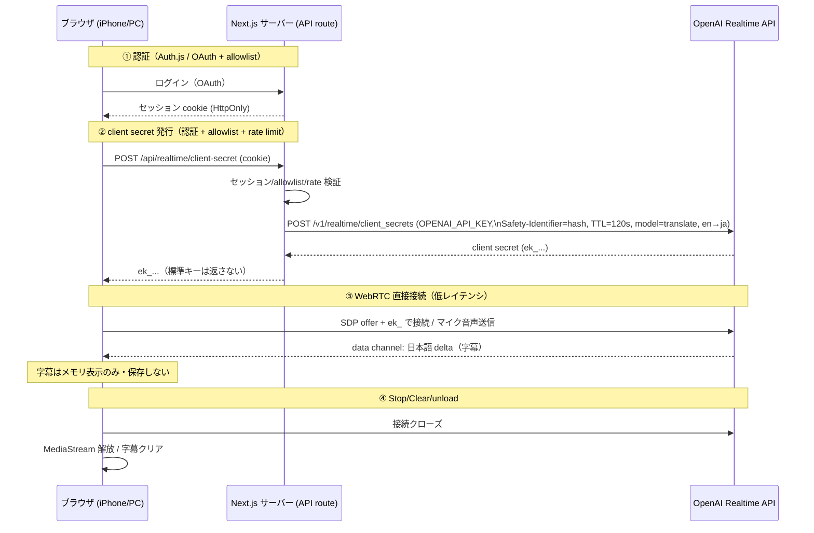

# docs/architecture.md — アーキテクチャ設計

## 1. 推奨アーキテクチャ（MVP 採用）

- **Next.js (App Router) + TypeScript + React**、単一アプリ。
- **Auth.js (NextAuth v5)** で OAuth + allowlist 認可。
- **API route**（`POST /api/realtime/client-secret`）が `OPENAI_API_KEY` を使い、OpenAI の `POST /v1/realtime/client_secrets` で短命 client secret を発行。
- **ブラウザが WebRTC** で OpenAI Realtime に直接ピア接続し、`gpt-realtime-translate` で英→日翻訳。マイク音声を送信、data channel で日本語 delta を受信して字幕表示。
- **DB 無し**（MVP）。本文は保存しない。
- **デプロイは Vercel**（採用理由は §4）。

### 採用理由
- WebRTC + ephemeral token は OpenAI 公式推奨で、標準キーをブラウザに出さずに低レイテンシ接続できる。
- `gpt-realtime-translate` は英→日のライブ翻訳専用モデルで、per-minute 課金のためコストが読みやすい。
- DB 無しは「本文を保存しない」要件と最も整合し、攻撃面とコストを最小化。

## 2. 代替アーキテクチャと棄却理由

| 案 | 概要 | 採否 | 理由 |
|---|---|---|---|
| WebSocket でサーバー中継 | ブラウザ↔自サーバ↔OpenAI を WS 中継 | 棄却 | レイテンシ増・サーバが本文を経由（ログ混入リスク増）・コスト増 |
| ブラウザから標準キー直接 | フロントでキー使用 | 厳禁 | 非交渉制約違反（キー露出） |
| `gpt-realtime-2` で翻訳指示 | 汎用モデルに翻訳指示 | 次点 | 可能だがトークン課金で読みにくく、専用 translate より重い。translate を優先 |
| 自前 STT(Whisper)+翻訳 LLM | 2 段構成 | 棄却（MVP） | レイテンシ・実装量増。MVP に過剰 |
| Cloudflare Workers / Fly.io | 別ホスティング | 次点 | Next.js + Auth.js の体験は Vercel が最短。将来移行余地として保持 |

## 3. データフロー図（Mermaid）

## 4. デプロイ構成

- **MVP: Vercel**（Next.js 一体型、環境変数の暗号化管理、HTTPS 既定、プレビュー環境）。
- 代替: Cloudflare（エッジ・低コスト）、Fly.io（常駐が必要になった場合）。MVP では不要。
- 環境変数はデプロイ先のシークレットに登録。`.env.local` は手元のみ。

## 5. コンポーネント一覧

- `app/page.tsx`: ログイン導線（未認証時）。
- `app/translate/page.tsx`: 翻訳画面（認証必須）。
- `components/Subtitles.tsx`: 字幕表示（メモリのみ）。
- `components/Controls.tsx`: Start / Stop / Clear。
- `lib/auth.ts`: Auth.js 設定（OAuth + allowlist コールバック）。
- `lib/allowlist.ts`: メール照合ユーティリティ。
- `lib/safetyId.ts`: メール → ハッシュ識別子。
- `lib/realtimeClient.ts`: WebRTC 接続ライフサイクル（クライアント）。
- `app/api/realtime/client-secret/route.ts`: client secret 発行 API。
- `middleware.ts`: 認証ガード。

## 6. API endpoint 設計

| メソッド/パス | 認証 | 入力 | 出力 | 備考 |
|---|---|---|---|---|
| `GET /` | 不要 | - | ログイン導線 | 公開 |
| Auth.js routes | - | OAuth | セッション | NextAuth 標準 |
| `GET /translate` | 必須 | - | 翻訳 UI | 未認証はリダイレクト |
| `POST /api/realtime/client-secret` | 必須+allowlist+rate | cookie | `{ clientSecret: "ek_...", expiresAt }` | 標準キーを返さない |

## 7. フロントエンド状態管理

- ローカル component state + 軽量 hook のみ（Redux 等は入れない）。
- 状態: `idle | requesting | connecting | live | stopping | error`。
- 字幕: 直近 N 行をメモリ配列で保持（保存しない）。Clear で空配列。

## 8. Realtime 接続ライフサイクル

1. `idle` → Start タップ → `requesting`（client secret 取得）。
2. `connecting`（getUserMedia → RTCPeerConnection → SDP 交換 → data channel open）。
3. `live`（delta 受信 → 字幕更新）。
4. Stop → `stopping`（data channel/PeerConnection close、トラック stop）→ `idle`。
5. error → 正規化エラー表示 → 再試行導線。

## 9. Stop / Clear / page unload 時の処理

- Stop: `pc.close()`、`stream.getTracks().forEach(t => t.stop())`、data channel close。
- Clear: 字幕配列を空にする（接続は維持 or 任意）。
- unload: `pagehide` / `beforeunload` / `visibilitychange(hidden)` で接続とトラックを確実に解放（iOS Safari は `pagehide` が確実）。

## 10. エラー時の処理

- client secret 取得失敗（401/403/429/5xx）→ 種別表示・再ログイン or リトライ。
- WebRTC 失敗 / ICE 切断 → 状態 `error`、手動再接続ボタン。
- マイク拒否 → 権限再許可の案内。

## 11. ローカル開発構成

- Node LTS、`npm`、`.env.local`、`npm run dev`（`http://localhost:3000`）。
- OAuth はテスト用クライアント ID。allowlist に自分のメール。
- 実キーは手元のみ。Agent には渡さない。
